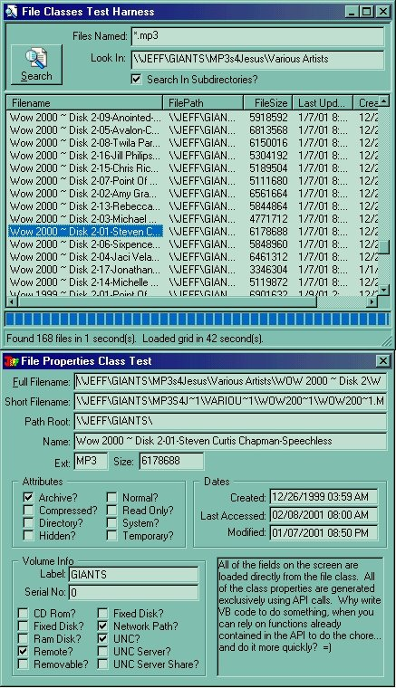

<div align="center">

## clsFile / colFiles \(File search and File properties API classes\)  FAST\!\!\!


</div>

### Description

I use these two classes to encapsulate a whole host of file oriented API calls... allowing me treat files as objects in my code and with the speed that is gained by going through the API.

The clsFile class wraps around a single file, and exposes a whole host of properties of a file (and the volume it is on) including: 16 bit equivalent path, parsed filename, size, attributes (readonly, system, archive, etc), dates (created, accessed, and modified) and volume properties: label, serial no., is a cdrom, fixed disk, remote, network path, unc info, etc. (see the screen shot for the full list). Besides being a read only property class, I have modified the .Attributes enum and the .DateLastModified properties to allow changes... so that when you change the properties on the class, the corresponding properties on the file are modified. Eventually, this class could also be modified to extend functions such as Rename, Delete, Copy and Move that would work through the Windows Shell. I have the code to do this, but never bothered patching it in since in my coding, I never ran into the situation where I needed to do these actions with the file object by itself. The colFiles class acts as a collection for the clsFile class. In addition to the methods you would expect from a collection, this class also encapsulates the API functions for file searching (including recursive directory searches). If you EVER intend to use a file search in your applications, going through the API is the ONLY way to achieve this in my opinion. You'll find many examples that try to use directory list boxes to perform file scans, but these examples will be painfully slow. The API, on the other hand, is extremely fast. As fast as the built in Find/Search screen in Windows Explorer. Plus... you are able to search through paths other than your mapped drives. This covers the entire Windows Explorer directory tree (network drives, namespace extensions, etc). Don't judge this class by the screen shots before knowing that in the screen shot example, I was searching across my network which consists of a slow 10Mb hub. You'll have to try it for yourself on your set up to see why I swear by these two classes when performing seek and file property operations. For updates to this or other cool vb code or controls, check my web page:                                                                                                          http://members.tripod.com/thefrogprince/                                                                                                         

If you are not currently involved in the coding contest, I WOULD REALLY APPRECIATE YOU VOTING FOR MY CODE. Will only take a minute or two to make an account, and while it won't make me any money... =) it will encourage me to keep posting good quality code and controls like this one. (check out my other posts too). =)
 
### More Info
 


<span>             |<span>
---                |---
**Submitted On**   |2001-02-11 21:12:30
**By**             |[TheFrogPrince](https://github.com/Planet-Source-Code/PSCIndex/blob/master/ByAuthor/thefrogprince.md)
**Level**          |Advanced
**User Rating**    |4.8 (162 globes from 34 users)
**Compatibility**  |VB 5\.0, VB 6\.0
**Category**       |[Files/ File Controls/ Input/ Output](https://github.com/Planet-Source-Code/PSCIndex/blob/master/ByCategory/files-file-controls-input-output__1-3.md)
**World**          |[Visual Basic](https://github.com/Planet-Source-Code/PSCIndex/blob/master/ByWorld/visual-basic.md)
**Archive File**   |[CODE\_UPLOAD148362122001\.zip](https://github.com/Planet-Source-Code/thefrogprince-clsfile-colfiles-file-search-and-file-properties-api-classes-fast__1-15136/archive/master.zip)

### API Declarations

```
DEMONSTRATES THE FOLLOWING API CALLS:
Public Declare Function FindFirstFile Lib "kernel32" Alias "FindFirstFileA" ( ByVal lpFileName As String, lpFindFileData As WIN32_FIND_DATA) As Long
Public Declare Function FindNextFile Lib "kernel32" Alias "FindNextFileA" ( ByVal hFindFile As Long, lpFindFileData As WIN32_FIND_DATA) As Long
Public Declare Function FindClose Lib "kernel32" ( ByVal hFindFile As Long) As Long
Public Declare Function GetVolumeInformation Lib "kernel32" Alias "GetVolumeInformationA" ( ByVal lpRootPathName As String, ByVal lpVolumeNameBuffer As String, ByVal nVolumeNameSize As Long, lpVolumeSerialNumber As Long, lpMaximumComponentLength As Long, lpFileSystemFlags As Long, ByVal lpFileSystemNameBuffer As String, ByVal nFileSystemNameSize As Long) As Long
Public Declare Function PathGetDriveNumber Lib "SHLWAPI.DLL" Alias "PathGetDriveNumberA" ( ByVal pszPath As String) As Long
Public Declare Function PathStripToRoot Lib "SHLWAPI.DLL" Alias "PathStripToRootA" ( ByVal pszPath As String) As Long
Public Declare Function PathIsNetworkPath Lib "SHLWAPI.DLL" Alias "PathIsNetworkPathA" ( ByVal pszPath As String) As Boolean
Public Declare Function PathIsUNCServerShare Lib "SHLWAPI.DLL" Alias "PathIsUNCServerShareA" ( ByVal pszPath As String) As Boolean
Public Declare Function PathIsUNCServer Lib "SHLWAPI.DLL" Alias "PathIsUNCServerA" ( ByVal pszPath As String) As Boolean
Public Declare Function PathIsUNC Lib "SHLWAPI.DLL" Alias "PathIsUNCA" ( ByVal pszPath As String) As Boolean
Public Declare Function OpenFile Lib "kernel32" ( ByVal lpFileName As String, lpReOpenBuff As OFSTRUCT, ByVal wStyle As Long) As Long
Public Declare Function CloseHandle Lib "kernel32" ( ByVal hObject As Long) As Long
Public Declare Function GetFileInformationByHandle Lib "kernel32" ( ByVal hFile As Long, lpFileInformation As BY_HANDLE_FILE_INFORMATION) As Long
Public Declare Function FileTimeToSystemTime Lib "kernel32" ( lpFileTime As FILETIME, lpSystemTime As SYSTEMTIME) As Long
Public Declare Function SystemTimeToFileTime Lib "kernel32" ( lpSystemTime As SYSTEMTIME, lpFileTime As FILETIME) As Long
Public Declare Function GetExpandedName Lib "lz32.dll" Alias "GetExpandedNameA" ( ByVal lpszSource As String, ByVal lpszBuffer As String) As Long
Public Declare Function GetShortPathName Lib "kernel32" Alias "GetShortPathNameA" ( ByVal lpszLongPath As String, ByVal lpszShortPath As String, ByVal cchBuffer As Long) As Long
Public Declare Function SetFileAttributes Lib "kernel32" Alias "SetFileAttributesA" ( ByVal lpFileName As String, ByVal dwFileAttributes As Long) As Long
Public Declare Function GetFileAttributes Lib "kernel32" Alias "GetFileAttributesA" ( ByVal lpFileName As String) As enumFileAttributes
Public Declare Function GetDriveType Lib "kernel32" Alias "GetDriveTypeA" (ByVal nDrive As String) As Long
```


